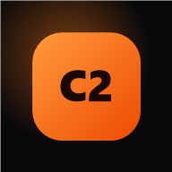

# Cloze C2

**Entrenador offline de Open Cloze para el examen Cambridge C2 Proficiency (CPE).**

Una app instalable en el iPhone desde Safari, sin tiendas, sin cuentas y sin
conexión. Contiene 48 textos originales de nivel C2 en formato examen y 300
ejercicios rápidos, construidos sobre una lista concreta de palabras y patrones
gramaticales, con un algoritmo de repetición espaciada que insiste en lo que
fallás hasta que deja de fallarse.

<p align="center">
  
</p>

---

## Qué hay dentro

| | |
|---|---|
| **48 textos** | Open Cloze completo, 8 huecos cada uno, formato Cambridge Part 2 |
| **384 huecos de examen** | Cada uno con su patrón identificado y explicación en español |
| **300 ejercicios rápidos** | Una frase, un hueco: repeticiones cortas guiadas por el algoritmo |
| **555 patrones** | Inversión negativa, concesivas antepuestas, condicionales invertidos, colocaciones, phrasal verbs, relativos con preposición |
| **0 KB de red** | Todo se precachea en la instalación y funciona en modo avión |

Los textos no son ejercicios reciclados: están escritos de cero alrededor de los
patrones de la lista de origen, de modo que cada palabra aparece en un contexto
nuevo cada vez que vuelve.

## Instalación en el iPhone

La app se publica en GitHub Pages y se instala desde Safari. Es gratis y no
requiere cuenta de desarrollador.

1. **Publicá el repositorio** (ver la sección siguiente).
2. En **Ajustes → Pages** del repo, elegí `Deploy from a branch` → rama `main` → carpeta `/ (root)`.
   GitHub te da una URL del tipo `https://TU-USUARIO.github.io/cloze-c2/`.
3. Abrí esa URL **en Safari** (no en Chrome: iOS solo permite instalar desde Safari).
4. Tocá el botón **Compartir** (el cuadrado con la flecha) → **Añadir a pantalla de inicio**.
5. Abrí la app desde el ícono nuevo. Ya no es una pestaña: no tiene barra de
   direcciones, ocupa toda la pantalla y arranca instantánea.
6. Para comprobarlo: activá el **modo avión** y abrila. Funciona igual.

> El progreso se guarda en el dispositivo. Para que el celular y la computadora
> vean lo mismo — y para no depender de un solo aparato — activá
> **Ajustes → Sincronización**: ver [docs/sync.md](docs/sync.md).

## Publicar el repositorio

Todo el historial ya está construido localmente. Solo falta enviarlo, y se envía
entero de una sola vez:

1. Creá un repositorio **vacío** en <https://github.com/new> (sin README, sin
   `.gitignore`, sin licencia). Llamalo `cloze-c2`.
2. Desde la carpeta del proyecto, ejecutá una línea:

   ```powershell
   .\scripts\publish.ps1 -RemoteUrl https://github.com/TU-USUARIO/cloze-c2.git
   ```

   El script configura el remoto y hace un único `git push` que sube los 58
   commits juntos. La primera vez, Git abre una ventana del navegador para que
   inicies sesión en GitHub.

Si preferís bash (Git Bash, WSL, macOS):

```bash
./scripts/publish.sh https://github.com/TU-USUARIO/cloze-c2.git
```

## Cómo estudia la app

El motor no lleva la cuenta de las palabras: lleva la cuenta de los **patrones**.
`WHAT` como relativo nominal y `WHAT` dentro de una oración hendida son dos
habilidades distintas y se programan por separado.

- Cada patrón vive en una **caja de Leitner** del 0 al 5.
- Acertar sube una caja; fallar baja **dos**.
- Los intervalos son 0, 1, 2, 4, 9 y 21 días.
- Un fallo vuelve además dentro de la **misma sesión**, tres tarjetas después.
- Se considera dominado a partir de la caja 4. El indicador de *Grade A* es el
  porcentaje de patrones dominados.

La consecuencia práctica: si fallás `Were it not for`, va a reaparecer esta tarde
en un ejercicio rápido, mañana en otra frase y la semana que viene dentro de un
texto completo distinto.

## Desarrollo

No hay build, ni bundler, ni dependencias en tiempo de ejecución. Se sirve tal cual.

```bash
npm install          # solo para el smoke test con jsdom
npm run serve        # http://localhost:8080
npm test             # 31 pruebas: contenido, algoritmo e interfaz
npm run lint:syntax  # parsea los 26 archivos que precachea el service worker
npm run icons        # regenera el set de iconos PNG
```

El service worker no se registra sobre `file://`, así que para probar el
funcionamiento offline hay que usar `npm run serve`.

## Documentación

| Documento | Contenido |
|---|---|
| [docs/architecture.md](docs/architecture.md) | Estructura, arranque y por qué no hay framework |
| [docs/srs-algorithm.md](docs/srs-algorithm.md) | El programador de repaso en detalle |
| [docs/content-model.md](docs/content-model.md) | Formato de textos y ejercicios, cómo añadir más |
| [docs/design-system.md](docs/design-system.md) | Tokens, escala tipográfica y motion |
| [docs/ios-installation.md](docs/ios-installation.md) | Instalación en iPhone y sus límites |
| [docs/deployment.md](docs/deployment.md) | GitHub Pages y publicación |
| [docs/accessibility.md](docs/accessibility.md) | Contraste, tamaños táctiles, motion reducido |
| [docs/performance.md](docs/performance.md) | Presupuesto de carga y estrategia de caché |
| [docs/roadmap.md](docs/roadmap.md) | Qué falta |

## Licencia

MIT. Ver [LICENSE](LICENSE).
